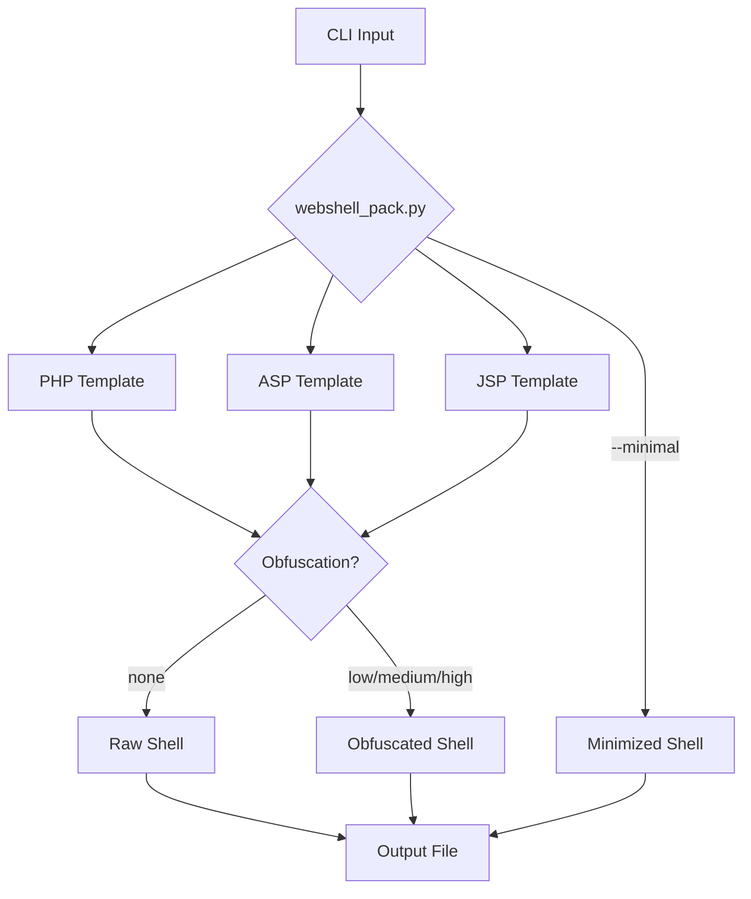

# WebShell-Pack

> **⚠️ WARNING:** Only deploy on servers you own or have explicit written authorization to test. Unauthorized web shell deployment is illegal. This tool is for authorized penetration testing and CTF challenges only.

Minimal web shell generator (PHP, ASP, JSP) with optional auth and obfuscation.
Single-file payloads, zero deps.

## Features

- PHP shell fits in 43 bytes (minimal mode)
- Auth password for access control
- Obfuscation levels: none / low / medium / high
- No dependencies outside Python stdlib

## Quick Start

```bash
# Generate a PHP shell (default)
python3 webshell_pack.py -t php -o shell.php

# Minimal PHP shell — smallest possible
python3 webshell_pack.py -t php --minimal -O shell.php

# With auth password
python3 webshell_pack.py -t php -a supersecret -O shell.php

# ASP shell with medium obfuscation
python3 webshell_pack.py -t asp -o medium -O shell.asp

# JSP shell with high obfuscation
python3 webshell_pack.py -t jsp -o high -O shell.jsp
```

## Usage

```text
usage: webshell_pack.py [-h] [-t {php,asp,jsp}] [-a AUTH] [-o {none,low,medium,high}] [-m] [-O OUTPUT]

WebShell-Pack v1.0 — minimal web shell generator

options:
  -h, --help            show this help message and exit
  -t, --type            shell type (php, asp, jsp) [default: php]
  -a, --auth            auth password for key-protected shell
  -o, --obfuscate       obfuscation level [none|low|medium|high]
  -m, --minimal         smallest possible shell (ignores auth/obfuscation)
  -O, --output          output file path
```

## Architecture



## Payload Gallery

| Type | Size (raw) | Lines | Auth Support |
|------|-----------|-------|-------------|
| PHP  | 43 B      | 1     | Yes         |
| ASP  | 136 B     | 1     | Yes         |
| JSP  | 239 B     | 1     | Yes         |

## Raw Payloads

Pre-built raw shells live in `payloads/`:

```bash
cat payloads/shell.php    # PHP one-liner
cat payloads/shell.asp    # ASP one-liner
cat payloads/shell.jsp    # JSP one-liner
```

## Testing

```bash
python3 -m pytest tests/ -v
```

## License

MIT © 2026 S8C88
